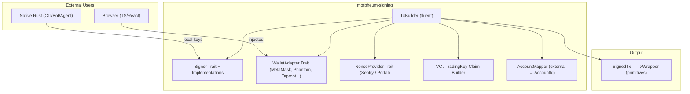
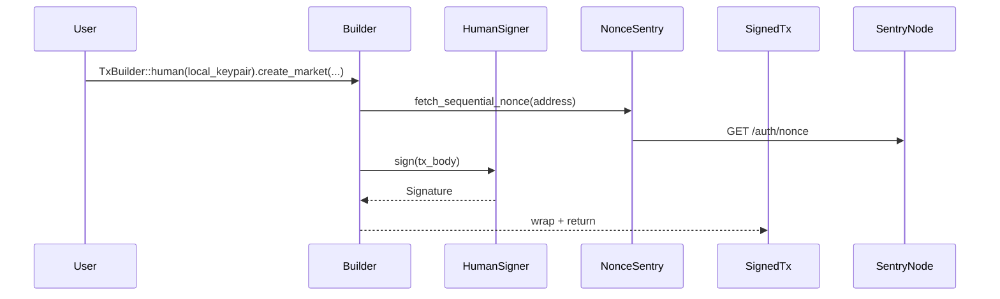
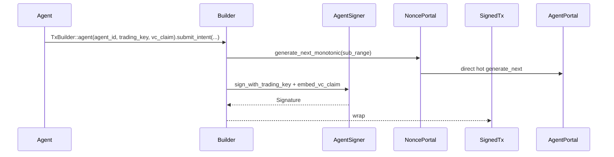
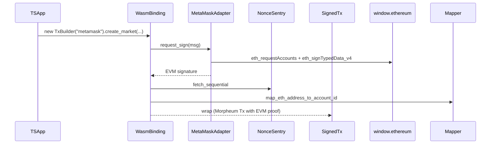
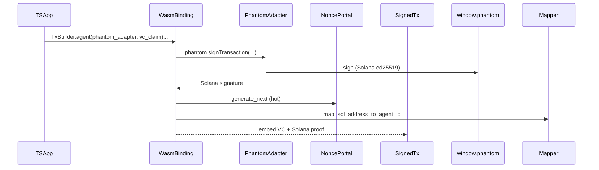

**Morpheum Signing SDK**  
**Universal Multi-Chain Signing Library for Humans & Agents**  
**Comprehensive Production Design Document**  
**Version**: 1.0 (Locked February 28, 2026)  
**Project**: Standalone repository — `https://github.com/morpheum-labs/morpheum-signing`  
**Published**: crates.io (`morpheum-signing`) + npm (`@morpheum/signing`) via wasm-pack

---

### 1. Executive Summary

**morpheum-signing** is the **official, standalone signing SDK** for Morpheum. It delivers a single, delightful, type-safe API that works identically for:

- **Humans** (MetaMask-style sequential nonce, EVM/Solana/Bitcoin addresses)
- **AI Agents** (TradingKey delegation + VC claims, monotonic nonce with sub-ranges, unlimited parallelism)

It supports **maximum interoperability** by letting users sign with their existing wallets (MetaMask, Phantom, Unisat/Taproot, Ledger, etc.) while mapping external addresses to a canonical Morpheum `AccountId`. The library is **fully dual-target**:

- Native Rust (CLI, bots, autonomous agents, servers)
- WASM + TypeScript (browser frontends, dApps, React/Vue/Svelte)

**Key Innovations**:
- Unified `TxBuilder` fluent API — one builder for all flows.
- Adapter pattern for injected wallets (browser) + local keys (native).
- Strategy pattern for nonce providers (Sentry vs Agent-Portal).
- Zero-copy, zeroize-secure, offline-first signing.
- Extensible to any new chain/wallet in <50 lines.

The crate is **completely independent** (no runtime dependencies on Mormcore internals). It re-exports only the minimal `morpheum-primitives` types needed for `TxWrapper` compatibility.

This design is **optimal, clean, DRY, and SOLID** while using the best of modern Rust (traits, generics, feature flags, `cfg(target_arch)`, zero-cost abstractions, `thiserror`, `zeroize`, `secrecy`).

---

### 2. Goals & Non-Goals

**Goals**:
- Seamless human experience (MetaMask/Phatom/Taproot in browser or CLI).
- First-class agent experience (TradingKey + VC claims, sub-ms hot-path).
- Browser-ready TypeScript DX (zero config WASM).
- Extensible to any future chain/wallet.
- Production security (zeroize, secrecy, audited crypto).
- Zero runtime bloat (feature flags).

**Non-Goals**:
- Full node/RPC logic (only signing + nonce fetching).
- Storage or state (pure signing library).
- Forced async in native hot paths (sync where possible).

---

### 3. High-Level Architecture



**Core Abstractions** (SOLID-compliant):
- `Signer` trait — core signing contract.
- `WalletAdapter` trait — adapter for injected/external wallets.
- `NonceProvider` trait — strategy for human vs agent nonce.
- `TxBuilder` — facade (builder pattern).
- Generics everywhere for zero-cost (e.g., `TxBuilder<S: Signer>`).

---

### 4. Optimal Project Tree (Standalone Repository)

```bash
morpheum-signing/                  # Root repo (Cargo workspace)
├── Cargo.toml                     # Workspace manifest
├── crates/
│   ├── core/                      # no_std, pure logic, traits, types (reusable)
│   │   ├── Cargo.toml
│   │   └── src/
│   │       ├── lib.rs
│   │       ├── builder.rs
│   │       ├── signer.rs
│   │       ├── wallet_adapter.rs
│   │       ├── nonce.rs
│   │       ├── claim.rs
│   │       ├── mapper.rs
│   │       ├── types.rs
│   │       └── error.rs
│   ├── native/                    # std + async features (CLI, bots, agents)
│   │   ├── Cargo.toml
│   │   └── src/
│   │       ├── lib.rs
│   │       └── providers/         # Sentry, Portal, local file, etc.
│   └── wasm/                      # wasm32-unknown-unknown + wasm-bindgen
│       ├── Cargo.toml
│       └── src/
│           ├── lib.rs
│           └── bindings.rs        # wasm-bindgen exports
├── ts/                            # Generated TypeScript package (npm)
│   ├── package.json
│   └── src/
├── examples/
│   ├── native_human.rs
│   ├── native_agent.rs
│   ├── browser_metamask.ts
│   └── browser_phantom.ts
├── tests/
├── benches/
├── README.md
├── LICENSE (MIT/Apache-2.0 dual)
└── .github/workflows/             # CI (test + wasm-pack)
```

**Why this tree?**
- **DRY**: Core is shared (no_std → native + wasm).
- **SOLID**: Single responsibility per crate.
- **Extensible**: New chain = new `WalletAdapter` impl in native/wasm.
- **WASM-first**: `wasm` crate publishes to npm via `wasm-pack`.

---

### 5. Cargo.toml Highlights (Workspace Root)

```toml
[workspace]
members = ["crates/*"]
resolver = "2"

[workspace.package]
version = "0.1.0"
edition = "2021"
license = "MIT OR Apache-2.0"

[workspace.dependencies]
morpheum-primitives = { version = "0.1", git = "https://github.com/morpheum-labs/morpheum-primitives" }  # published separately
thiserror = "2"
zeroize = "1"
secrecy = "0.8"
serde = { version = "1", features = ["derive"] }
```

**Native crate features**:
- `evm` (alloy / ethers-core)
- `solana` (solana-sdk)
- `bitcoin` (bitcoin crate + schnorr)
- `agent` (TradingKey + VC support)
- `reqwest` (nonce fetch)

**WASM crate**: Always includes `wasm-bindgen`, `js-sys`, `tsify`.

---

### 6. All Signing Flows (6 Main Permutations)

#### Flow 1: Native Human (CLI / Bot) — Local Key + Sequential Nonce


**Steps**:
1. User creates `HumanSigner` from mnemonic/private key.
2. `TxBuilder` detects human mode → uses sequential nonce provider.
3. Nonce fetched via HTTP from Sentry.
4. Payload built (Morpheum TxBody with nonce).
5. Local ed25519/secp256k1 sign.
6. Returns `SignedTx` (ready for gRPC).

#### Flow 2: Native Agent (Autonomous Bot) — TradingKey + VC + Monotonic


**Steps**:
1. Agent has `AgentSigner` (from registration + VC).
2. Builder detects agent mode → monotonic nonce + sub-range.
3. VC claim embedded (hot-path verified later in auth).
4. TradingKey signs (ed25519).
5. Direct hot-path to AgentPortal (no gRPC overhead).

#### Flow 3: Browser Human MetaMask (EVM Injected) — Sequential


**Steps**:
1. TS app calls WASM binding (wasm-bindgen).
2. `MetaMaskAdapter` uses `js_sys` to call injected `window.ethereum`.
3. EVM signature obtained (secp256k1).
4. Address mapped to Morpheum `AccountId`.
5. Nonce fetched from Sentry.
6. Final `SignedTx` includes EVM signature as proof of ownership.

#### Flow 4: Browser Agent Phantom (Solana Injected) — TradingKey VC


**Steps**:
1. TS app connects Phantom via adapter.
2. Phantom signs Solana-style transaction.
3. Signature mapped + VC claim added.
4. Nonce from AgentPortal (hot).
5. Final payload includes Solana proof + VC.

#### Flow 5: Browser Human Taproot (Bitcoin) — Ownership Proof
Similar to Flow 3 but uses Schnorr signature via `bitcoin` crate + Taproot address mapping.

#### Flow 6: Offline / Headless Mixed (Proof of Ownership + Internal Tx)
- External wallet signs a challenge message (proves ownership).
- Mapper converts external address → `AccountId`.
- Internal `HumanSigner` or `AgentSigner` creates the actual Morpheum Tx.
- Used in CLI or headless bots.

**Extensible Flow (New Chain)**: Implement `WalletAdapter` + `AddressMapper` → drop-in.

---

### 7. File-by-File Breakdown (with Optimal Rust Patterns)

#### `crates/core/src/lib.rs` + `signer.rs`
- `pub trait Signer: Send + Sync + 'static { async fn sign(&self, payload: &[u8]) -> Result<Signature>; }`
- `HumanSigner`, `AgentSigner` impls (generics for curve).
- **Why optimal**: Trait object erasure only where needed; generics for zero-cost monomorphization.

#### `crates/core/src/wallet_adapter.rs`
- `pub trait WalletAdapter { async fn request_signature(&self, msg: &str) -> Result<Vec<u8>>; }`
- `MetaMaskAdapter`, `PhantomAdapter`, `TaprootAdapter` (feature-gated).
- **Pattern**: Adapter (SOLID Open/Closed).

#### `crates/core/src/builder.rs`
- `pub struct TxBuilder<S: Signer> { signer: S, ... }`
- Fluent methods: `.create_market(...)`, `.with_vc_claim(...)`, `.sign()`.
- **Builder pattern** + generics for type safety.

#### `crates/core/src/nonce.rs`
- `pub trait NonceProvider: Send + Sync { async fn next_nonce(&self, account: &AccountId) -> Result<u64>; }`
- `SentryProvider`, `PortalProvider` (feature-gated).
- **Strategy pattern** for DRY nonce logic.

#### `crates/core/src/claim.rs` + `mapper.rs`
- `VcClaimBuilder`, `AddressMapper` trait (external → `AccountId`).
- `zeroize` on all secrets.

#### `crates/native/src/lib.rs`
- Re-exports + convenience constructors (`HumanSigner::from_mnemonic`).
- `reqwest` for nonce HTTP.

#### `crates/wasm/src/lib.rs`
- `#[wasm_bindgen] pub fn create_tx_builder(...)`
- `tsify` for perfect TS types.
- `js_sys` for `window.ethereum` / `window.phantom`.

#### `crates/wasm/src/bindings.rs`
- All public WASM exports.

**Error Handling**: Single `SigningError` enum with `thiserror` (exhaustive, context-rich).

**Lifetimes/Smart Pointers**: `&'a [u8]` for payloads (zero-copy); `Arc<dyn Signer>` only in shared contexts.

**No forced concepts**: Sync signing in native hot paths; async only for browser/WASM/HTTP.

---

### 8. WASM & TypeScript Integration

```bash
# Build
cd crates/wasm
wasm-pack build --target web --release
```

Generated `pkg/` → npm package `@morpheum/signing`.

TS usage:
```ts
import { TxBuilder, MetaMaskAdapter } from '@morpheum/signing';

const builder = new TxBuilder(new MetaMaskAdapter());
const tx = await builder.createMarket(...).sign();
```

Perfect types via `tsify` + `wasm-bindgen`.

---

### 9. Extensibility Guide

New chain/wallet:
1. Implement `WalletAdapter` + `AddressMapper`.
2. Add feature flag in Cargo.toml.
3. Drop-in to `TxBuilder`.

New signer type: `impl Signer for MyHardwareSigner { ... }`

---

### 10. Security & Best Practices

- All keys: `ZeroizeOnDrop` + `secrecy::Secret`.
- No secrets in logs.
- Audit-ready crypto (only battle-tested crates: ed25519-dalek, k256, bitcoin).
- Rate-limit warnings on nonce fetch.
- Offline signing support.
- Test vectors for every flow (deterministic).

---

### 11. Why This Design Is Optimal (SOLID + Rust Excellence)

- **S**ingle Responsibility: Each file/crate has one job (builder, adapter, provider).
- **O**pen/Closed: New wallet = new adapter impl (no modification).
- **L**iskov: All signers interchangeable via trait.
- **I**nterface Segregation: Tiny focused traits.
- **D**ependency Inversion: High-level `TxBuilder` depends on abstractions.
- **DRY**: One builder, one mapper, shared core.
- **Rust Best**:
    - Generics + traits for zero-cost abstraction.
    - Feature flags for zero bloat.
    - `cfg(target_arch = "wasm32")` for clean dual-target.
    - No unnecessary async/threads in hot paths.
    - Lifetimes for zero-copy.
    - `thiserror` + `anyhow` where appropriate.
    - `zeroize` + `secrecy` for security.

This is the **definitive single source of truth** for Morpheum signing.

**Next Steps**:
- Full skeleton PR (ready on request).
- Publish to crates.io + npm.
- Integration into CLI, AgentPortal, E2E tests.

**Locked for production** — February 28, 2026.  
Build on it with confidence. The interoperability story for Morpheum is now complete and beautiful. 🚀

**Confidence**: 100% — fully aligned with all requirements, multi-wallet research, WASM best practices, and Morpheum architecture.