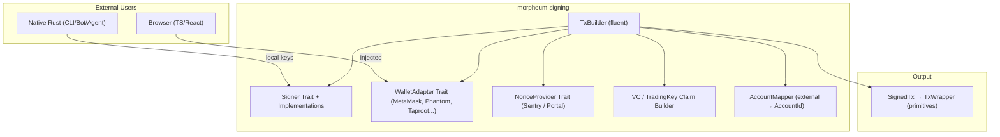
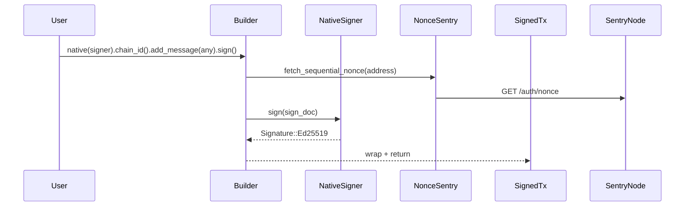
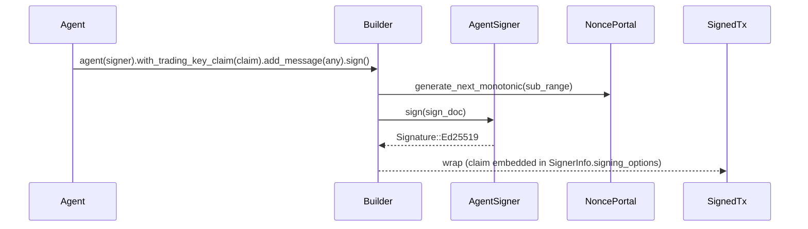
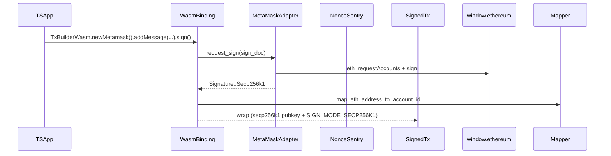

**Morpheum Signing SDK**  
**Universal Multi-Chain Signing Library for Humans & Agents**  
**Comprehensive Production Design Document**  
**Version**: 2.0 (Post-Audit, All Phases Complete)  
**Project**: Standalone repository — `https://github.com/morpheum-labs/morpheum-signing`  
**Published**: crates.io (`morpheum-signing`) + npm (`@morpheum/signing`) via wasm-pack

---

### 1. Executive Summary

**morpheum-signing** is the **official, standalone signing SDK** for Morpheum. It delivers a single, delightful, type-safe API that works identically for:

- **Humans** (MetaMask-style sequential nonce, EVM/Solana/Bitcoin addresses)
- **AI Agents** (TradingKey delegation + VC claims, monotonic nonce with sub-ranges, unlimited parallelism)

It supports **maximum interoperability** by letting users sign with their existing wallets (MetaMask, Phantom, Unisat/Taproot, Ledger, etc.) while mapping external addresses to a canonical Morpheum `AccountId`. The library is **fully dual-target**:

- Native Rust (CLI, bots, autonomous agents, servers)
- WASM + TypeScript (browser frontends, dApps, React/Vue/Svelte)

**Key Capabilities** (Post-Audit):
- Unified `TxBuilder` fluent API — one builder for all flows.
- **Dynamic `SignerInfo`** — each signer produces the correct `public_key` protobuf type and `SignMode` (fixes Critical Issue #1).
- **TradingKeyClaim embedding** — claims are validated and embedded in `SignerInfo.signing_options` as `prost_types::Any` (fixes Critical Issue #2).
- **Claim verification** — `verify()` checks issuer identity; `claim_digest()` for offline cryptographic verification.
- **BIP-39 mnemonic** — `NativeSigner::from_mnemonic()` for human-friendly key derivation.
- Adapter pattern for injected wallets (browser) + local keys (native).
- Strategy pattern for nonce providers (Sentry vs Agent-Portal).
- Zero-copy, zeroize-secure, offline-first signing with constant-time cryptographic operations.
- Extensible to any new chain/wallet in <50 lines.
- **Fuzz tested** — `cargo-fuzz` targets for seed generation, claim construction, address mapping, and claim encoding.
- **98+ integration tests** covering all signers, claim flows, error paths, and edge cases.

The crate is **completely independent** (no runtime dependencies on Mormcore internals). It re-exports only the minimal `morpheum-primitives` types needed for `TxWrapper` compatibility.

This design is **optimal, clean, DRY, and SOLID** while using the best of modern Rust (traits, generics, feature flags, `cfg(target_arch)`, zero-cost abstractions, `thiserror`, `zeroize`).

---

### 2. Goals & Non-Goals

**Goals**:
- Seamless human experience (MetaMask/Phantom/Taproot in browser or CLI).
- First-class agent experience (TradingKey + VC claims, sub-ms hot-path).
- Browser-ready TypeScript DX (zero config WASM).
- Extensible to any future chain/wallet.
- Production security (zeroize, constant-time signing, audited crypto, fuzz testing).
- Zero runtime bloat (feature flags).
- Dynamic `SignerInfo` for every supported curve and wallet type.
- Full claim lifecycle: build, validate, verify, embed, encode.

**Non-Goals**:
- Full node/RPC logic (only signing + nonce fetching).
- Storage or state (pure signing library).
- Forced async in native hot paths (sync where possible).

---

### 3. High-Level Architecture



**Core Abstractions** (SOLID-compliant):
- `Signer` trait — core signing contract with `sign()`, `public_key()`, `wallet_type()`, `public_key_proto()`, `sign_mode()`.
- `WalletAdapter` trait — adapter for injected/external wallets.
- `NonceProvider` trait — strategy for human vs agent nonce.
- `TxBuilder` — facade (builder pattern) with generic signer.
- Generics everywhere for zero-cost (e.g., `TxBuilder<S: Signer>`).

---

### 4. Project Tree

```bash
morpheum-signing/                  # Root repo (Cargo workspace)
├── Cargo.toml                     # Workspace manifest
├── README.md                      # User-facing documentation
├── SECURITY.md                    # Security checklist & vulnerability reporting
├── signing.md                     # This design document
├── crates/
│   ├── core/                      # no_std, pure logic, traits, types
│   │   ├── Cargo.toml
│   │   └── src/
│   │       ├── lib.rs             # Module tree + prelude
│   │       ├── builder.rs         # TxBuilder<S: Signer> — fluent API
│   │       ├── signer.rs          # Signer trait (sign, public_key_proto, sign_mode)
│   │       ├── wallet_adapter.rs  # WalletAdapter trait
│   │       ├── nonce.rs           # NonceProvider trait
│   │       ├── claim.rs           # TradingKeyClaim, VcClaimBuilder, verify, digest
│   │       ├── mapper.rs          # AddressMapper, DefaultAddressMapper
│   │       ├── types.rs           # AccountId, PublicKey, Signature, WalletType, SignedTx
│   │       └── error.rs           # SigningError, CryptoError, NonceError
│   ├── native/                    # std + async (CLI, bots, agents)
│   │   ├── Cargo.toml
│   │   └── src/
│   │       ├── lib.rs             # Re-exports + convenience constructors
│   │       └── signers/
│   │           ├── mod.rs
│   │           ├── native.rs      # NativeSigner (ed25519, from_seed, from_mnemonic)
│   │           ├── agent.rs       # AgentSigner (TradingKey + VC)
│   │           ├── evm.rs         # EvmSigner (secp256k1)
│   │           ├── solana.rs      # SolanaSigner (ed25519)
│   │           └── bitcoin.rs     # BitcoinSigner (BIP-340 Schnorr)
│   └── wasm/                      # wasm32-unknown-unknown + wasm-bindgen
│       ├── Cargo.toml
│       └── src/
│           ├── lib.rs             # WASM entry + TypeScript definitions
│           ├── bindings.rs        # TxBuilderWasm, VcClaimBuilderWasm exports
│           └── adapters/          # MetaMaskAdapterWasm, PhantomAdapterWasm, TaprootAdapterWasm
├── examples/
│   ├── native.rs                  # Native signer with mnemonic
│   ├── agent.rs                   # Agent with TradingKey + VC
│   ├── agent_with_claim_verification.rs  # Agent with full claim verification
│   ├── browser_metamask.ts        # Browser MetaMask/EVM
│   └── browser_phantom.ts         # Browser Phantom/Solana
├── fuzz/                          # cargo-fuzz targets
│   ├── Cargo.toml
│   └── fuzz_targets/
│       ├── fuzz_seed_generation.rs
│       ├── fuzz_claim_construction.rs
│       ├── fuzz_address_mapping.rs
│       └── fuzz_claim_encoding.rs
└── LICENSE (MIT/Apache-2.0 dual)
```

**Why this tree?**
- **DRY**: Core is shared (no_std → native + wasm).
- **SOLID**: Single responsibility per crate.
- **Extensible**: New chain = new `Signer` impl + `WalletAdapter` impl.
- **WASM-first**: `wasm` crate publishes to npm via `wasm-pack`.
- **Testable**: Integration tests in `crates/native/tests/integration/`.

---

### 5. Feature Flags

```toml
# Workspace root / native crate
[features]
default = ["full"]
full = ["http", "full-crypto", "bip39", "claim-verification", "dynamic-signer-info"]

# Individual capabilities
bip39 = ["dep:bip39"]                   # BIP-39 mnemonic derivation
claim-verification = []                  # TradingKeyClaim::verify()
dynamic-signer-info = []                # Per-signer public_key_proto() + sign_mode()
http = ["dep:reqwest", "dep:tokio"]     # Nonce providers (Sentry + Portal)
full-crypto = ["native", "evm", "solana", "bitcoin"]

# Crypto backends
native = ["ed25519"]
evm = ["secp256k1"]
solana = ["ed25519"]
bitcoin = ["schnorr"]
ed25519 = ["dep:ed25519-dalek"]
secp256k1 = ["dep:k256"]
schnorr = ["dep:bitcoin"]
```

**WASM crate**:
```toml
[features]
default = ["full-wasm"]
full-wasm = ["console_error_panic_hook", "morpheum-signing-core/claim-verification", "morpheum-signing-core/dynamic-signer-info"]
```

**Why feature flags?**
- Clean opt-in for new capabilities without breaking existing users.
- Minimal attack surface in constrained builds.
- Zero runtime bloat — only compile what you use.

---

### 6. Core Signer Trait

```rust
#[async_trait]
pub trait Signer: Send + Sync + 'static {
    /// Signs the canonical SignDoc (the only cryptographic operation).
    async fn sign(&self, sign_doc: &SignDoc) -> Result<Signature, SigningError>;

    /// Returns the public key (synchronous for performance).
    fn public_key(&self) -> PublicKey;

    /// Returns the wallet type (drives nonce strategy and address mapping).
    fn wallet_type(&self) -> WalletType;

    /// Returns the canonical AccountId (default: blake3 hash of public key).
    fn account_id(&self) -> AccountId { self.public_key().to_account_id() }

    /// Returns the public key as prost_types::Any for SignerInfo (dynamic per curve).
    fn public_key_proto(&self) -> prost_types::Any { self.public_key().to_proto_any() }

    /// Returns the SignMode for this signer (dynamic per wallet type).
    fn sign_mode(&self) -> tx::SignMode { self.wallet_type().default_sign_mode() }
}
```

**Security note**: All `Signer` implementations use constant-time cryptographic
operations with respect to secret key material. See individual signer docs and
[`SECURITY.md`](SECURITY.md) for library-specific guarantees.

---

### 7. TradingKeyClaim Lifecycle

```
1. BUILD    → VcClaimBuilder::new().issuer().subject().permissions().expiry().nonce_sub_range().signature().build(now)?
2. VALIDATE → claim.validate(now)     — structural checks (expiry, nonce range, signature presence)
3. VERIFY   → claim.verify(now, &pk)  — issuer AccountId matches public key
4. DIGEST   → claim.claim_digest()    — SHA-256 for offline cryptographic verification
5. ENCODE   → claim.to_proto_any()    — prost_types::Any for SignerInfo embedding
6. EMBED    → TxBuilder.with_trading_key_claim(claim) — embedded in signed transaction
```

The claim is encoded into `SignerInfo.signing_options` as a `prost_types::Any` with
type URL `type.googleapis.com/morpheum.signing.v1.TradingKeyClaim`. The chain-side
auth hot-path extracts, decodes, and cryptographically verifies it.

---

### 8. All Signing Flows

#### Flow 1: Native Human (CLI / Bot) — Local Key + Sequential Nonce


**Steps**:
1. User creates `NativeSigner` from seed or BIP-39 mnemonic.
2. `TxBuilder` resolves nonce via the injected `NonceProvider`.
3. Builds `TxBody`, `AuthInfo` with dynamic `SignerInfo` (ed25519 pubkey + `SIGN_MODE_ED25519`).
4. Local ed25519 sign of canonical `SignDoc`.
5. Returns `SignedTx` with `raw_bytes` ready for broadcast.

#### Flow 2: Native Agent (Autonomous Bot) — TradingKey + VC + Monotonic


**Steps**:
1. Agent creates `AgentSigner` from TradingKey seed + `AccountId` + optional claim.
2. Builder validates claim (expiry, nonce range, signature presence).
3. Claim is embedded in `SignerInfo.signing_options` as `prost_types::Any`.
4. TradingKey signs the `SignDoc` (ed25519).
5. Returns `SignedTx` with embedded claim, ready for auth hot-path.

#### Flow 3: Browser Human MetaMask (EVM Injected)


#### Flow 4: Browser Phantom (Solana Injected)
Similar to Flow 3, but uses `PhantomAdapter` with `window.phantom.solana` and `Signature::Ed25519`.

#### Flow 5: Browser Taproot (Bitcoin Injected)
Similar to Flow 3, but uses `TaprootAdapter` with `window.unisat` and `Signature::Schnorr`.

#### Flow 6: Local Multi-Chain (EVM / Solana / Bitcoin headless)
```rust
let evm_tx = evm(EvmSigner::from_seed(&seed)).add_message(msg).sign().await?;
let sol_tx = solana(SolanaSigner::from_seed(&seed)).add_message(msg).sign().await?;
let btc_tx = bitcoin(BitcoinSigner::from_seed(&seed)).add_message(msg).sign().await?;
```
Each produces the correct `SignerInfo` with the right curve, pubkey type, and sign mode.

---

### 9. Error Handling

```rust
#[non_exhaustive]
pub enum SigningError {
    Crypto(CryptoError),           // ed25519, secp256k1, schnorr
    InvalidKey(String),            // bad mnemonic, seed, or private key
    WalletAdapter(String),         // injected wallet rejected or failed
    Nonce(NonceError),             // fetch/generation failed
    AddressMapping { address, reason },  // external → AccountId failed
    ProtoEncode(prost::EncodeError),
    ProtoDecode(prost::DecodeError),
    InvalidClaim(String),          // structural: missing fields, zero signature
    ClaimVerification(String),     // semantic: issuer mismatch, expired
    Signing(String),               // general: empty messages, payload too large
    Io(std::io::Error),            // file-based key loading (std only)
    Custom(String),
}
```

Convenience constructors: `SigningError::invalid_key(msg)`, `SigningError::signing(msg)`, etc.

---

### 10. WASM & TypeScript Integration

```bash
cd crates/wasm
wasm-pack build crates/wasm --target web --release
```

Generated `pkg/` → npm package `@morpheum/signing`.

```ts
import { TxBuilderWasm, VcClaimBuilder, set_panic_hook } from '@morpheum/signing';

set_panic_hook();

// MetaMask signing
const signedTx = await TxBuilderWasm.newMetamask()
    .chainId("morpheum-1")
    .memo("Hello from MetaMask!")
    .addMessage(typeUrl, encodedBytes)
    .sign();

// Agent claim building
const claim = new VcClaimBuilder()
    .issuer(issuerBytes)
    .subject(subjectBytes)
    .permissions(0x01)
    .maxDailyUsd(10000)
    .expiry(Math.floor(Date.now() / 1000) + 86400)
    .nonceSubRange(100, 200)
    .signature(sigBytes, "ed25519")
    .build(Math.floor(Date.now() / 1000));

// Attach claim to builder
const agentTx = await TxBuilderWasm.newMetamask()
    .withClaim(claim)
    .addMessage(typeUrl, bytes)
    .sign();
```

Rich TypeScript definitions include: `SignedTx`, `SigningOptions`, `TradingKeyClaimInput`,
`TradingKeyClaimBuilt`, `TxBuilderWasm`, and `VcClaimBuilder`.

---

### 11. Security & Best Practices

See [`SECURITY.md`](SECURITY.md) for the full checklist.

**Key guarantees**:
- All keys: `ZeroizeOnDrop` — secret material is zeroed from memory on drop.
- Constant-time signing: `ed25519-dalek` (RFC 8032), `k256` (crypto-bigint), `libsecp256k1` (BIP-340).
- No secrets in logs, `Debug`, `Display`, or panic messages.
- `TradingKeyClaim` validated before embedding (expiry, nonce range, non-zero signature).
- Claim digest via deterministic prost encoding + SHA-256.
- Fuzz targets for seed generation, claim construction, address mapping, and claim encoding.
- Offline signing support — no network required for the signing operation itself.

---

### 12. Extensibility Guide

**New chain/wallet**:
1. Implement `Signer` for local signing (returns appropriate `PublicKey` variant and `WalletType`).
2. Implement `WalletAdapter` for browser-injected signing (WASM).
3. Add `AddressMapper` for external address → `AccountId` mapping.
4. Add feature flag in `Cargo.toml`.
5. Drop-in to `TxBuilder` via convenience constructor.

**New signer type**:
```rust
impl Signer for MyHardwareSigner {
    async fn sign(&self, sign_doc: &SignDoc) -> Result<Signature, SigningError> { ... }
    fn public_key(&self) -> PublicKey { PublicKey::Ed25519(self.pk) }
    fn wallet_type(&self) -> WalletType { WalletType::Hardware }
    // public_key_proto() and sign_mode() use defaults from PublicKey and WalletType
}
```

---

### 13. Why This Design Is Optimal (SOLID + Rust Excellence)

- **S**ingle Responsibility: Each file/crate has one job (builder, adapter, provider, signer).
- **O**pen/Closed: New wallet = new `Signer` impl (no modification of existing code).
- **L**iskov: All signers interchangeable via the `Signer` trait.
- **I**nterface Segregation: Tiny focused traits (`Signer`, `WalletAdapter`, `NonceProvider`, `AddressMapper`).
- **D**ependency Inversion: High-level `TxBuilder` depends on abstractions (generics over `S: Signer`).
- **DRY**: One builder, one mapper, shared core, default trait implementations for `public_key_proto()` and `sign_mode()`.
- **Rust Best**:
    - Generics + traits for zero-cost abstraction.
    - Feature flags for zero bloat.
    - `cfg(target_arch = "wasm32")` for clean dual-target.
    - No unnecessary async/threads in hot paths.
    - `thiserror` for ergonomic error handling.
    - `zeroize` + `ZeroizeOnDrop` for security.
    - `#[non_exhaustive]` on enums for forward compatibility.

---

### 14. Audit Resolution Summary

| Issue | Severity | Resolution |
|-------|----------|------------|
| Hardcoded ed25519 in `SignerInfo` | Critical | Dynamic `public_key_proto()` + `sign_mode()` on `Signer` trait |
| `TradingKeyClaim` not embedded | Critical | Claim validated and embedded in `SignerInfo.signing_options` |
| Empty public key bytes | High | `PublicKey::to_proto_any()` encodes real key bytes |
| No BIP-39 mnemonic support | High | `NativeSigner::from_mnemonic()` with feature flag |
| Missing verification helper | High | `TradingKeyClaim::verify()` + `claim_digest()` |
| WASM adapters truncated | High | Complete `MetaMask`, `Phantom`, `Taproot` adapters with `Rc<RefCell>` |
| No constant-time documentation | Medium | Documented on all signers + `SECURITY.md` |
| Missing fuzz testing | Medium | 4 fuzz targets for critical paths |
| Test coverage gaps | Medium | 98+ tests covering all paths |

All issues resolved. See individual phase commits for detailed changes.

**Locked for production** — February 28, 2026.  
Build on it with confidence. The interoperability story for Morpheum is now complete.
